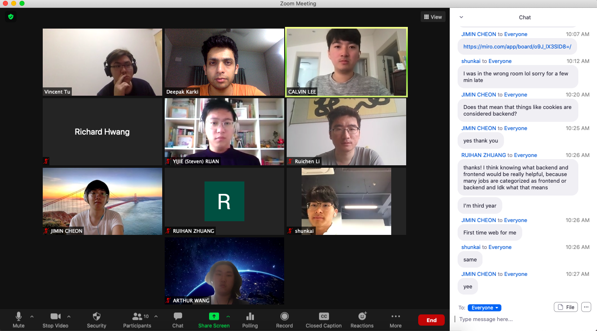

# Internet Bowser 
## Type of Meeting: TA Meeting
## All members were present during the meeting
## Location and Time:
Meeting is held using Zoom and started at 1:30 pm (KST)

## Agenda 

### Recap from Previous Meeting 
None, this was our first meeting 

### Topic To Go Over
- Update status on the project
- StandUp Update
- Questions regarding the project 

### What was actually discussed 
- Demostrated our prototype website that meets the basic needs of pomodoro technqiue but havent implemented the functionality yet
- Give update on our Miro board
- Distingush the differnce between Backend and Frontend
  - Realize that most of the stuff we did are mostly frontnd, backend hasnt really been introduced yet
- How to fix the issue with the timer stays on the mushroom even after adjusting the website window size 

### New Topic for Next Time 
- Backend Demo 101 since most of us do not have experince in that field 

### Decisions Made During the Meeting 

N/A

### Not Discussed on the Agenda 
- Discuss the agreemenet document and general rules for our group 

## Time Ended: 2:00 pm (KST)

## Screentshot Of the Meeting

