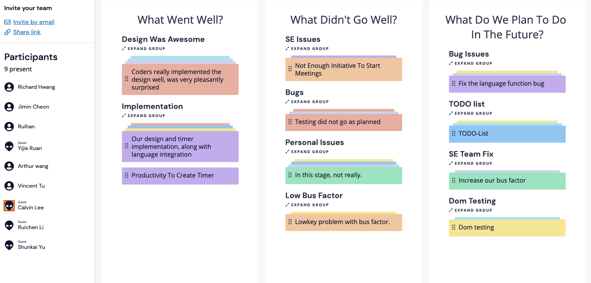
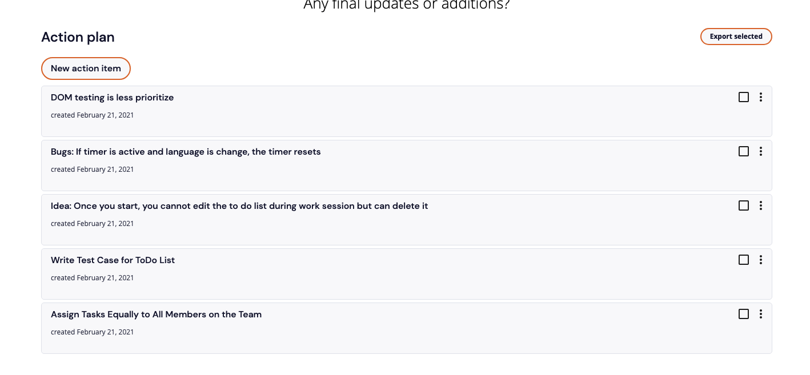

# Internet Bowser 
## Meeting Type: Sprint Retrospective 
### Where was it held:
On zoom at 3:05 pm (KST)
### Attendence:
Everyone was presented during the meeting 

### What happened:
- Acknowledge that we have a low bus factor issue going on around right now 
  - Solution: Assigns Task Equally to Everyone to start parallel projects to be more efficient and increase bus factor
- Design Team did a great job designing the UI that is related to our Mario Theme aspect 
- DOM Testing, due to low bus factor, this is becoming an issue as not enough people can help as the difficulty is relatively high 
  - Solution: Worked in parallel and less prioritize to have more time learning about the testing and can focus more on features to be implemented
- Bugs
  - When the timer is active, changing the langauge during the session will cause the timer to restart, currently an issue on GitHub 
- Features to be implemented: 
  - ToDo List is our main feature to add to our pomodoro timer as of now
    - So far the idea is to have user be able to add to the task list and once the timer starts, the user cannot add any more but can delete it once the task is completed
- StandUp are not being performed as people tend to forget
  - Solution: Create a Reminder Bot and have the team reply to the reminder on the slack channel for easier access and timestamp
  
### Screenshots from the Meeting: 

### Meeting Ended:
Ended at 4:10pm (KST)
