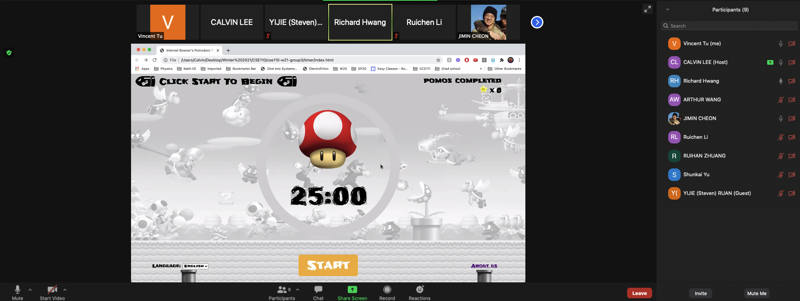

# Internet Bowser
## Meeting Type: Sprint Review
### Meeting Time:
Held over zoom at 2:30pm (KST)
### Attendence:

### Finished Sprint 1 !!!!!!

### Accomplishments from each member 
Calvin Lee - Translate Design from the designer team to HTML 
Vincent Tu - Coordinating and organizing meeting so all members can meet up together
Richard Hwang - Started to get an understanding on JEST testing 
Yijie Ruan - Figure out the basic strucutre unit-testing, wrote couple of basic testings 
Ruichen Li - Helped with the translation and language setting (Mostly Japanese) and learn JEST
Jimin Cheon - Coming up with the mario theme designed approved by the team
Shunkai Yu - Created the backup plan for UI and worked on testing on debugging the fakeTimer issue.
Arthur Wang - Work on the creation of CI/CD pipeline in order do the doucmentation display 
Ruihan Zhang - Contribute to the creation of pipeline and figure out how to get it working

### Photos From the Meeting 

### Meeting Ended: 
Ended at 3:00pm(KST) 
