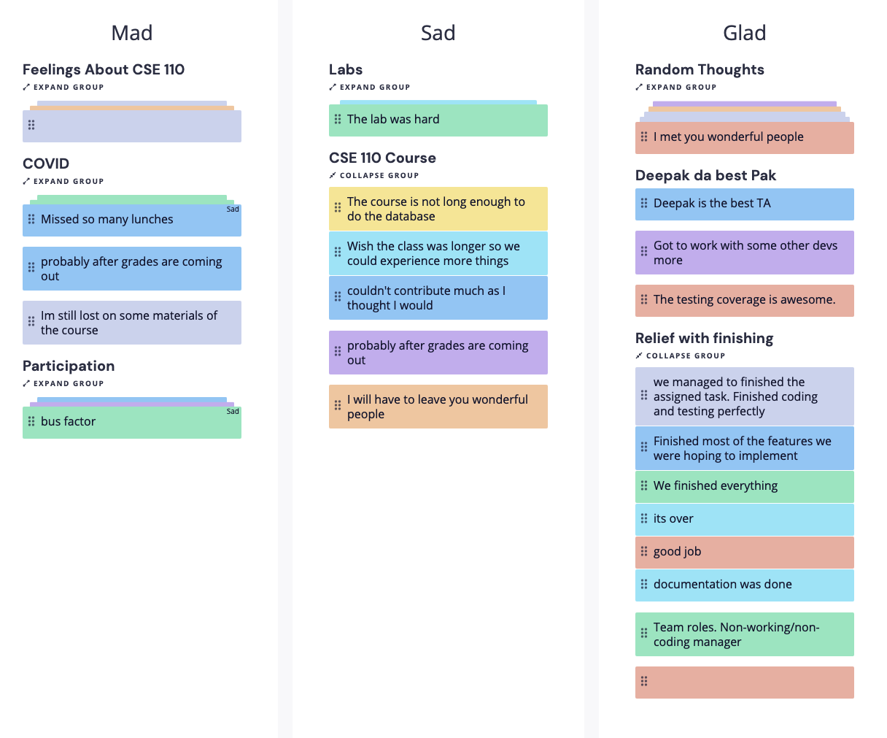

# Internet Bowser 
## Meeting Type: Sprint 2 Retrospective 
### Where was it held:
On zoom at 2:45 pm (KST)
### Attendence:
Everyone was presented during the meeting 

### What happened:
- Closing Thoughts:
  - Everyone contrbuted to the project 
  - Glad that testing is figured out (DOM, Jest, End-To-End, Unit)
  - Team Synergy is good 
  - Everyone did the role correctly 
  - Local Storage and ToDO List modification is working as exepected
  - 100% Test Coverage as of now 
  - Think this CSE 110 course is good but due to inexpereince, we struggled a lot and learned a lot at the same time 
  
### Screenshots from the Meeting: 

### Meeting Ended:
Ended at 3:30pm (KST)
