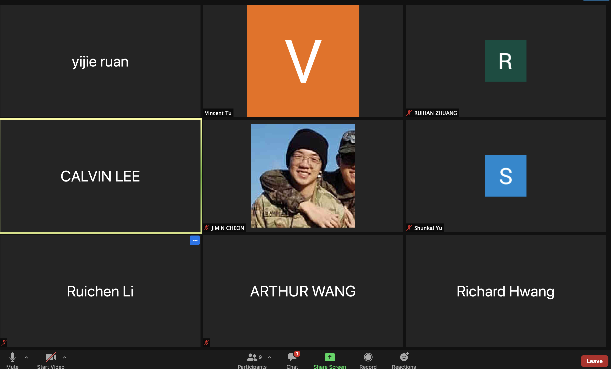

# Team: Internet Bowser
# Meeting Type: Sprint Review 
## Finish Sprint 2!!!!!
### Meeting Started: 
2:00pm (KST)

### Accomplishment from each member:
Calvin Lee - Documentation, Basic ToDoList, Disabled add/delete and language setting during work session, Unit Testing, Jest Testing, DOM Testing, 
End-To-End Testing, update CI/CD Pipeline 

Vincent Tu - Coordinating and organizing meeting so all members can meet up together, worked on converting standups to github repo from slack,
work on ADRs and make sure issues on github 

Richard Hwang - Experiment with the ToDoList

Yijie Ruan - Documentation, Basic ToDoList, Disabled add/delete and language setting during work session, Unit Testing, Jest Testing, DOM Testing, 
End-To-End Testing, update CI/CD Pipeline 

Ruichen Li - Local Storage ToDo List, Disabled add/delete and language setting, Cypress Testing (Majority),Unit Testing, Jest Testing, DOM Testing, 
End-To-End Testing

Jimin Cheon - Worked on documentation (Review and Double Check) 

Shunkai Yu - Reviewed and double checked documentation 

Arthur Wang - Helped design the first version of todo list, also worked on the team status video

Ruihan Zhang - Helped with designing the first version of todolist and team status video 

### Photos From the Meeting 

### Meeting Ended: 
Ended at 2:40pm(KST) 
